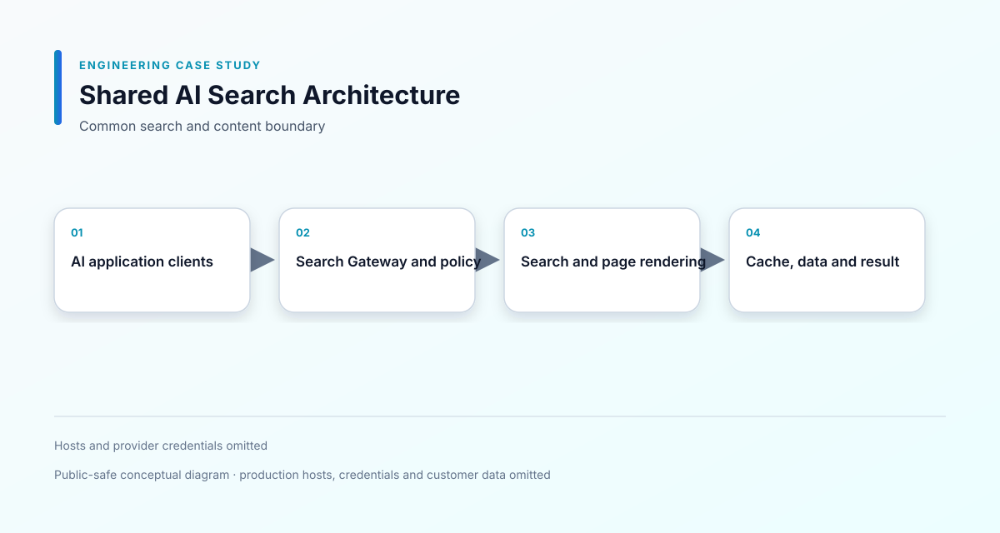

# 共用 AI 搜尋基礎設施

[English](README.md)

**期間：** 2026/05 – 至今  
**專案類型：** 商業專案／Platform Engineering  
**角色：** Platform / Integration Engineer  
**重點：** Search Gateway · SearXNG · Crawl4AI · Request Policy

## 一、專案概述

提供多個 AI 應用共用的搜尋與網頁內容服務，統一外部搜尋、頁面取得與內容正規化流程。

## 二、專案背景

多個 AI 應用都需要搜尋與網頁內容能力。如果每個應用各自處理 Provider、Timeout、錯誤與安全規則，容易造成重複與不一致，因此抽離成共用平台。

## 三、我的角色

我負責 Docker Compose 服務設計、Search Gateway、Provider Adapter、SearXNG、Crawl4AI、網路與環境設定、Host Policy、請求限制與應用整合。

## 四、負責範圍

- 定義共用搜尋服務邊界
- 建立統一的搜尋與網頁內容 API
- 串接搜尋結果與渲染後頁面內容
- 加入 API Key 與網域政策驗證
- 限制 Timeout 與 Response Size
- 處理 Provider 失敗與服務不可用
- 將搜尋責任從應用程式 Repo 抽離
- 透過 Adapter 讓 POS 與 AI 應用接入
- 維護 Container Network 與 Reverse Proxy 設定

## 五、技術環境

- Services：SearXNG、Crawl4AI
- Data / Cache：PostgreSQL、Redis
- Integration：HTTP API、Search Gateway、Provider Adapter
- Infrastructure：Docker Compose、Reverse Proxy、Environment Configuration

## 六、系統架構

- [Mermaid 原始圖](diagrams/system-architecture.mmd)
- [搜尋請求流程](diagrams/search-request-flow.svg)

## 七、主要工程挑戰

### 建立穩定的整合邊界

應用程式不應該知道目前使用哪一個搜尋 Provider 或頁面 Renderer，因此將 Provider 細節封裝在 Gateway 後方。

### 控制外部請求

搜尋與頁面擷取可能連接任意外部網域，因此加入 Host Policy、Authentication、Timeout 與 Response Size 控制。

### 共用基礎設施與應用解耦

平台需要支援不同 Consumer，同時維持設定與失敗處理的可理解性，因此使用 Adapter 與環境設定，而不是在各應用複製 Provider 邏輯。

## 八、技術決策

- 使用 Gateway 作為應用程式唯一的搜尋入口。
- 將 Provider-specific behavior 放在 Adapter 後方。
- 在外部網路請求前先套用 Request Policy。
- 分離搜尋、渲染與產品業務邏輯。
- 使用 Docker Compose 重現服務關係。

## 九、可靠性與安全性

- API Key Boundary
- Host Allowlist
- Timeout 與 Response Size 限制
- Provider Error Handling
- Container Network Separation
- Environment-based Service Configuration
- 不在公開 Repo 放置正式主機與憑證

## 十、取捨與限制

共用平台可以減少重複，但也會增加共同營運依賴。正式部署仍需要完整監控、容量規劃與 Provider Availability 證據。

## 十一、成果

建立可重複使用的搜尋邊界，讓 AI 應用可以取得外部資訊，而不必在每個產品內重複處理 Provider 與網路邏輯。

## 十二、學習

平台工程的核心是邊界設計：只有當服務契約、失敗模式與安全政策清楚時，共用服務才真正能降低複雜度。

## 保密聲明

這是商業平台元件。公開內容不包含正式原始碼、憑證、客戶資料或專有基礎設施細節。

