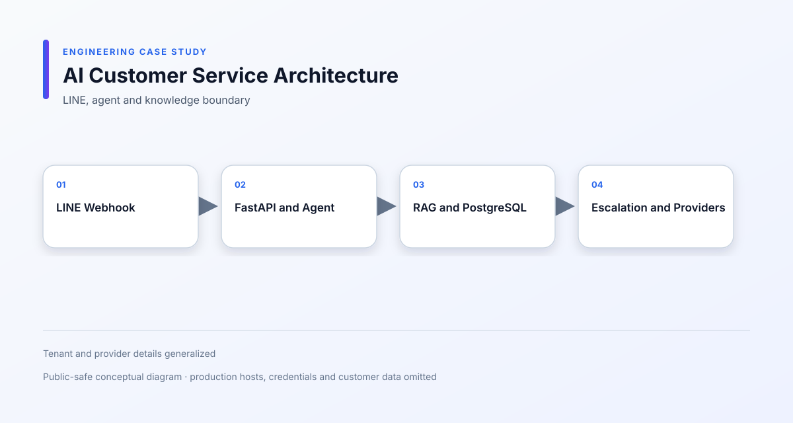

# 多租戶 AI 客服平台

[English](README.md)

**期間：** 2026/05 – 至今  
**專案類型：** 商業專案／全職工作  
**角色：** AI Application / Backend Engineer  
**重點：** LangGraph · RAG · Hybrid Retrieval · LINE · Tenant Isolation

## 一、專案概述

以 LINE 為入口，整合訊息接收、知識檢索、AI Agent 與人工轉接的智能客服平台。

## 二、專案背景

不同組織的客服問題需要使用各自的知識內容。系統必須維持租戶隔離、提供可控的知識檢索，並在 AI 無法安全回答時轉交人工處理。

## 三、我的角色

我負責 LINE Webhook、FastAPI、LangGraph Agent、RAG、混合檢索、知識庫、租戶權限、非同步錯誤處理與外部 AI 服務整合。

## 四、負責範圍

- 接收與驗證 LINE 訊息
- 將對話連結至正確的租戶與使用者
- 建立 Agent 的問題處理與回覆流程
- 實作向量搜尋與關鍵字搜尋
- 加入 Query Rewrite、Embedding 與排名合併
- 建立 AI 無法回答時的人工轉接
- 管理知識內容與後台設定
- 處理 Webhook 重複事件
- 處理 LLM、Embedding 與通知服務的非同步錯誤
- 整合通知與語音相關服務

## 五、技術環境

- Backend：FastAPI、Python
- AI：LangGraph、LLM、Embedding
- Retrieval：PostgreSQL、pgvector、BM25、RRF
- Integration：LINE Messaging API、Webhook、Notification、TTS
- Infrastructure：Docker、Background Tasks、Database Migration

## 六、系統架構

- [Mermaid 原始圖](diagrams/system-architecture.mmd)
- [LINE Agent 流程](diagrams/line-agent-flow.svg)
- [RAG Pipeline](diagrams/rag-pipeline.svg)
- [多租戶模型](diagrams/multi-tenant-model.svg)

## 七、主要工程挑戰

### 混合語意與關鍵字檢索

向量搜尋適合語意理解，關鍵字搜尋則能補足產品名稱、政策用語與組織專有名詞，因此建立混合檢索與排名合併流程。

### 維持租戶知識隔離

相同問題在不同組織可能有不同答案，因此租戶上下文必須從 Webhook、檢索、Prompt 到 Agent 回覆一路傳遞。

### 處理不確定答案

當系統沒有足夠證據時，不應產生看似確定的回答，因此建立無法回答與人工轉接流程。

### 處理外部服務失敗

LLM、Embedding 與 Messaging Provider 可能個別失敗，因此加入非同步錯誤處理與清楚的失敗狀態。

## 八、技術決策

- 使用混合檢索，而不是只依賴向量相似度。
- 在 Agent 取得內容前先完成租戶範圍過濾。
- 分離 Webhook 驗證、對話狀態、檢索與回覆生成。
- 將人工轉接視為正式業務流程。
- 將第三方憑證放在設定中，不寫入業務邏輯。

## 九、可靠性與安全性

- LINE Signature Verification
- Webhook Deduplication
- Tenant-aware Retrieval
- 後台權限檢查
- 敏感資料處理
- 非同步例外處理
- Provider 設定隔離
- 人工轉接與安全 fallback

## 十、重製畫面

- [LINE Conversation](screenshots/line-conversation.svg)
- [Knowledge Base](screenshots/knowledge-base.svg)
- [Agent Settings](screenshots/agent-settings.svg)

以上均為去識別化重製畫面，使用範例資料，不是正式客戶截圖。

## 十一、取捨與限制

本案例描述應用程式與檢索設計，不宣稱正式服務流量、第三方 SLA 或實際客服準確率。

目前的背景處理方式適合現階段範圍；若未來文件匯入規模增加，可再改為持久化 Queue 與獨立 Worker。

## 十二、成果

完成從 LINE 訊息接收、租戶知識檢索、Agent 回覆到人工轉接的完整流程。

## 十三、學習

這個專案加深我對 RAG 品質、AI Workflow、租戶上下文與不確定答案安全處理的理解。

## 保密聲明

這是商業專案。公開內容不包含正式原始碼、憑證、客戶資料或專有商業資訊。

