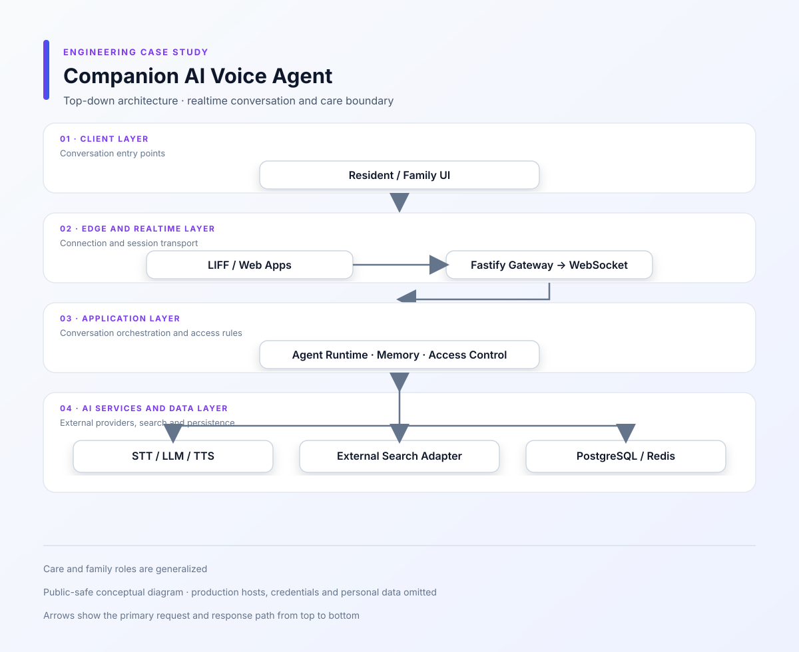
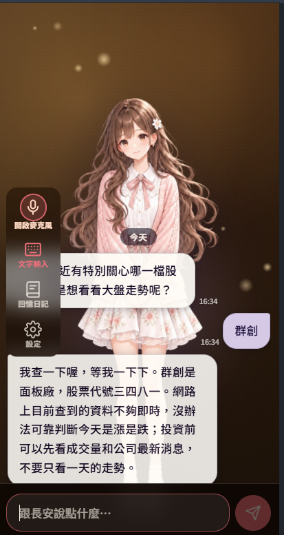

# Companion AI Voice & Agent Platform

[繁體中文](README.md)

**Period:** 2026/08 – 2026/09 
**Type:** Commercial / Full-time 
**Role:** Full-stack / AI Application Engineer 
**Focus:** Realtime voice · WebSocket · Agent runtime · Memory and access control

## What the product does

A companion AI platform combining voice conversation, memory, knowledge retrieval and access for family or care-team users. The frontend includes LIFF, web and administrative surfaces, while a gateway maintains the realtime voice session.

## What I worked on

- Connected the STT → LLM → TTS conversation lifecycle
- Managed utterances, transcripts, generations and playback state
- Added session continuity, replay and cancellation behavior for dropped WebSocket connections
- Built administrative configuration for MCP, tools, skills, knowledge bases and external search
- Separated resident, family and care-team access, memory retention and deletion flows
- Added limits around sockets, requests, logs and container resources
- Kept voice, reading-mode and replay controls understandable for older users

## The hard part was not STT → LLM → TTS

Voice becomes difficult in the states between those services. The user may still be speaking while an earlier reply is playing, and a reconnect can happen at the same time. A single conversation state would let these events overwrite each other, so I separated utterance, generation and playback state.

### Transcript order is not answer order

Partial transcripts, final transcripts and generations do not always finish in the order the UI receives them. I bound turns to generations so a late transcript cannot start the wrong reply, and an old socket cannot cancel a newer generation.

### Reconnects must preserve the active conversation

After a WebSocket drop, the system needs to know whether to resume, stop or guide the user through recovery. Session continuity, identity, expiry and stale-socket checks therefore follow the same rules.

### Agent capabilities need an explicit control surface

MCP, tools, skills, knowledge bases and external search should not be enabled in every context. I kept them behind administrative settings and provider boundaries rather than coupling the conversation flow to one search vendor.

## Architecture and flows

- [Voice agent pipeline](diagrams/voice-agent-pipeline.svg)
  - [Agent runtime](diagrams/agent-runtime.svg)
  - [Mermaid source](diagrams/system-architecture.mmd)

  ## Screenshots

  These screenshots show the companion AI voice entry point, text interaction and memory-oriented UI without production user data or service branding.

  

  

  ## Technology

The applications use TypeScript, LIFF, Fastify, React and administrative / family-facing web clients. Realtime communication uses WebSocket; the AI layer includes STT, LLM, TTS, agent tools and knowledge retrieval; PostgreSQL, Redis and Docker support the runtime.

**skills:** Node.js, Fastify, React, WebSocket, LLM, Agent, MCP, Tools, Skills, STT, TTS, SearXNG, ElevenLabs

## Trade-offs and public scope

Realtime voice quality still depends on browser permissions, network conditions and external speech providers. The public version describes application-level state coordination, recovery, access control and resource limits; it does not include production personal data, credentials or provider SLA claims.
