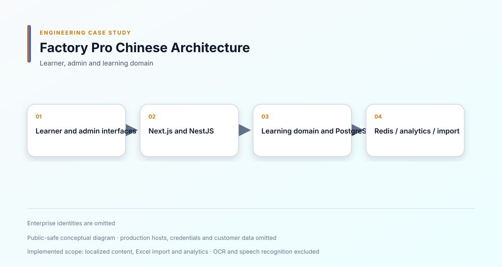

# Factory Pro Chinese 工廠學習平台

[English](README.en.md)

**期間：** 2026/06 – 2026/07 
**專案類型：** 商業專案／全職工作 
**角色：** Full-stack Engineer 
**重點：** Next.js · NestJS · Learning Platform · Multi-tenancy · Analytics

## 一、專案概述

支援企業訓練、課程學習、學習進度與管理分析的多租戶學習平台。

## 二、專案背景

不同企業具有不同的管理者、學員、教材與報表需求，因此平台需要同時支援一致的學習流程、在地化內容、進度追蹤與後台操作。

## 三、我的角色

我負責學員端與管理後台、Backend API 串接、學習領域邏輯、多租戶驗證、在地化、Analytics、匯入流程與 Docker 部署問題排查。

## 四、負責範圍

- 補完學員與後台未完成頁面
- 實作課程、教材與學習進度
- 處理經驗值、Streak、推薦、徽章與證書
- 整合 HSK 詞彙、拼音、注音、越南語近似發音與工廠情境教材
- 將報表接上實際 Analytics API
- 建立學員參與度與學習分析
- 開發批次匯入與管理後台流程
- 加入多語系內容與後台在地化
- 修正認證、API Route 與租戶隔離
- 改善 Validation 與 Modal 確認流程
- 修正 RWD 與行動版導覽
- 處理 Container Build、Health Route 與部署設定

## 五、技術環境

- Frontend：Next.js、React、Tailwind-style UI
- Backend：NestJS、Node.js
- Data：PostgreSQL、Redis
- Integration：Translation、Speech、OCR、Zalo、Push Notification
- Infrastructure：Docker、CI-oriented Deployment

**skills:** TypeScript, Next.js, NestJS, PostgreSQL, Redis, Docker, Multi-tenant, RBAC, PWA

## 六、系統架構

- [Mermaid 原始圖](diagrams/system-architecture.mmd)
- [學習流程](diagrams/learning-flow.svg)
- [內容匯入](diagrams/content-import.svg)
- [Tenant / RBAC](diagrams/tenant-rbac.svg)

## 七、主要工程挑戰

### 維持學習進度一致

課程完成、Lesson Progress、經驗值與 Streak 依賴同一批學習行為。我整理前後端規則，使畫面與 Analytics 使用一致的學習狀態。

### 支援企業資料分離

不同公司需要獨立的使用者、內容與報表，因此將 Tenant Context 貫穿認證、API 與管理流程。

### 將報表連接真實資料

報表不能只是靜態畫面，因此將 Analytics API 接入，並建立學員參與度與學習狀況檢視。

### 安全處理批次匯入

課程與學員匯入可能包含格式不完整或不一致資料，因此加入驗證、預覽與結果回饋。

## 八、技術決策

- 將學習進度視為 Domain State，而不是只有前端顯示值。
- 將 Tenant Context 貫穿認證、API 與報表。
- 透過明確 Validation 處理匯入，不靜默接受錯誤資料。
- 分離學員互動與管理者分析。
- 將在地化內容與學習流程放在一致的內容模型中。

## 九、可靠性與安全性

- Authentication 與 Tenant Isolation
- API Route 與 Identity Validation
- Input Validation
- Progress 與 Streak 一致性
- 安全的管理後台匯入
- Container Health Check
- Build 與 Deployment Troubleshooting

## 十、重製畫面

學員、課程與管理後台畫面會使用範例資料製作，待後續補上。

## 十一、取捨與限制

本案例聚焦學習與管理功能，不包含正式學員資料、企業身份與 Provider 憑證。

## 十二、成果

完成企業學習平台中課程、進度、Analytics、在地化與資料匯入等主要作業流程。

## 十三、學習

這個專案加深我對 Learning Domain、Multi-tenant Product 與真實資料串接的理解。

## 保密聲明

這是商業專案。公開內容不包含正式原始碼、憑證、客戶資料或專有商業資訊。
