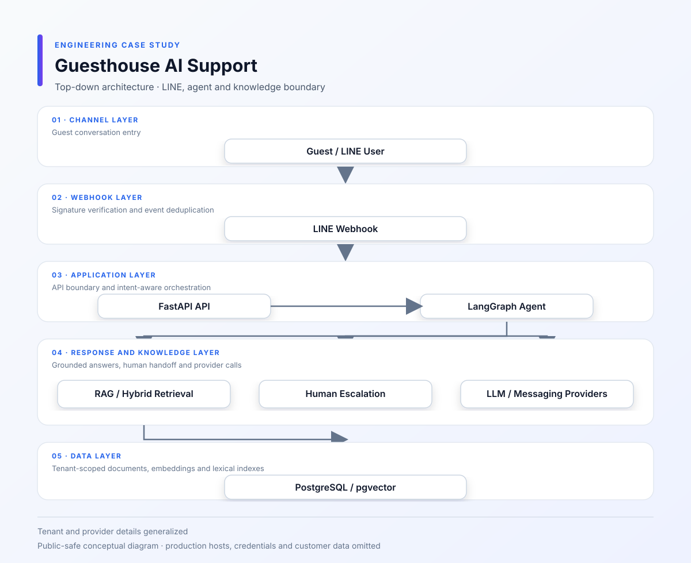
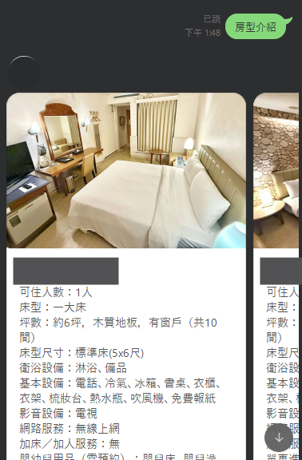
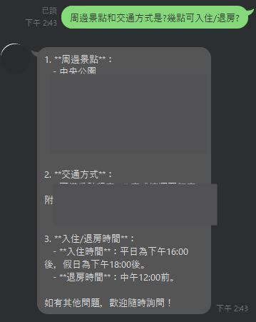

# 民宿 AI 客服與知識庫平台

[English](README.en.md)

**期間：** 2026/05 – 2026/06 
**專案類型：** 商業專案／全職工作 
**角色：** AI Application / Backend Engineer 
**重點：** LINE OA · Intent Routing · RAG · Hybrid Retrieval · 多租戶

## 這個客服實際在處理什麼

這是一套以 LINE OA 為入口的民宿客服。使用者會問房型列表、房間細節、聯絡方式、預約相關問題或一般問題；如果明確要求真人，或系統找不到足夠資料，就轉到人工客服，不讓 Agent 硬湊答案。

## 我做的部分

- 用 FastAPI 接收和驗證 LINE Webhook，處理重複事件
- 用 LangGraph 把訊息分到房型、房間詳情、聯絡、預約、一般問題或人工轉接
- 串接民宿資料工具與知識庫，讓房型和聯絡資訊不必全部塞在 Prompt 裡
- 建立文件解析、Chunking、PII Masking、Embedding 與索引流程
- 把向量搜尋、文字搜尋／BM25 和 Weighted RRF 接在同一條檢索流程
- 維持 Tenant Context、權限和 Provider 錯誤狀態

## 我遇到的問題

### 只靠向量搜尋，精確名稱不一定找得到

一開始如果只靠向量搜尋，遇到房型名稱、政策名稱或民宿自己的專有名詞時不一定抓得準，所以後來把向量搜尋和文字搜尋一起用，再透過 RRF 合併結果。這部分不是為了讓流程看起來更複雜，而是在補 semantic search 容易漏掉精確字詞的問題。

### 同一句話在不同民宿可能有不同答案

租戶不能只在登入時判斷一次。Webhook 收到訊息後，租戶、使用者、知識來源和工具都要沿著同一條路由傳下去，否則很容易拿到另一個民宿的房型或政策。

### AI 沒有證據時，轉人工比亂答好

Agent 會依意圖進入 RAG、民宿資料工具或人工客服流程。當檢索結果不足、Provider 失敗，或使用者直接要求真人時，回覆會進入安全 fallback，而不是用一段看似確定的文字掩蓋問題。

## 架構與流程

- [LINE Agent 流程](diagrams/line-agent-flow.svg)
- [RAG Pipeline](diagrams/rag-pipeline.svg)
- [多租戶模型](diagrams/multi-tenant-model.svg)
- [Mermaid 原始圖](diagrams/system-architecture.mmd)

## 畫面展示

以下畫面保留 LINE 民宿客服的功能流程，房源名稱、帳號頭像與其他識別資訊已遮罩。

## 技術

Backend 使用 FastAPI／Python；Agent 使用 LangGraph；檢索使用 PostgreSQL、pgvector、BM25 與 RRF；入口是 LINE Messaging API。文件內容會先做切分、敏感資料處理與 Embedding，再提供給查詢流程使用。

**skills:** Python, FastAPI, LangGraph, PostgreSQL, pgvector, RAG, Embedding, BM25, RRF, LINE Messaging API, LLM

## 取捨與公開範圍

目前文件描述的是應用程式、路由與檢索設計，不宣稱正式服務流量、第三方 SLA 或實際客服準確率。正式民宿名稱、資料、憑證與部署資訊不公開；文件匯入規模若再增加，背景處理也需要改成持久化 Queue 與獨立 Worker。
