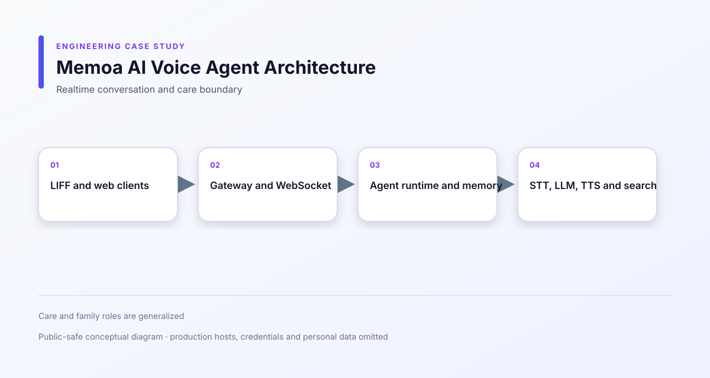

# Memoa AI Voice Agent

[繁體中文](README.zh-TW.md)

**Period:** 2026/05 – Present 
**Type:** Commercial / Full-time 
**Role:** Full-stack / AI Application Engineer 
**Focus:** Realtime Voice Agent · WebSocket · STT → LLM → TTS · Privacy

## 1. Overview

A realtime AI voice companion and care platform that combines conversational voice interaction, memory, knowledge retrieval and family or care-team access.

## 2. Project Context

Voice interaction has different reliability requirements from ordinary request-response screens. The system must coordinate microphone state, transcription, generation, playback, reconnect behavior and conversation ownership without losing the user's context.

## 3. My Role

**Full-stack / AI Application Engineer**

I worked across:

- TypeScript monorepo applications
- LIFF and web interfaces
- Gateway and API integration
- WebSocket voice sessions
- STT → LLM → TTS orchestration
- Conversation and memory handling
- Care and family access
- Reliability, privacy and resource controls

## 4. Scope & Responsibilities

Selected responsibilities included:

- Building the voice conversation lifecycle
- Managing transcription ownership and utterance state
- Handling generation cancellation and playback state
- Preserving sessions across dropped connections
- Implementing voice and recognition settings
- Improving senior-friendly interaction patterns
- Supporting replay, reading modes and accessible controls
- Separating resident, family and care-team data access
- Managing memory, knowledge retention and deletion behavior
- Adding limits for sockets, logs, container resources and requests
- Moving shared search functionality into the Infra platform

## 5. Tech Stack

**Applications**  
TypeScript, LIFF, Fastify, administrative and family-facing web apps

**Realtime**  
WebSocket

**AI**  
Speech-to-text, LLM, text-to-speech, agent tools and knowledge retrieval

**Data**  
PostgreSQL, Redis

**Infrastructure**  
Docker, shared search gateway and external AI providers

## 6. System Architecture

[View Mermaid source](diagrams/system-architecture.mmd)

## 7. Key Engineering Challenges

### Coordinating a realtime voice turn

A single conversation can involve microphone capture, partial transcript, final transcript, generation, audio playback and cancellation. I separated these states and tied them to the correct utterance and generation.

### Recovering from reconnects

A dropped WebSocket connection should not erase the resident's active conversation. I implemented session continuity and clarified when a reconnect should resume, stop or show recovery guidance.

### Preventing cross-session confusion

The system must not answer the wrong room, reuse another resident's transcript or allow an old socket to terminate a newer conversation. I strengthened identity, expiry and generation ownership checks.

### Making complex controls usable

Voice settings, pacing, calibration, reading modes and replay behavior need to be understandable for older users. I simplified the interaction patterns and improved state feedback.

## 8. Technical Decisions

- Treat every conversation turn and generation as an explicit unit.
- Scope playback and cancellation to the generation that created it.
- Preserve session context across reconnects while keeping authorization boundaries.
- Keep memory retention and deletion as explicit data lifecycle operations.
- Place shared web search behind the common platform instead of coupling each application to a provider.

## 9. Important Flows

- Voice input to spoken response: [Voice agent pipeline](diagrams/voice-agent-pipeline.svg)
- Agent decision and tool execution: [Agent runtime](diagrams/agent-runtime.svg)

## 10. Reliability & Security

- Session and identity validation
- Reconnect and stale-socket handling
- Request and socket limits
- Container memory and log limits
- Care-panel authorization
- Retention and resident deletion
- Outbound tool argument protection
- External provider failure states

## 11. External Integrations

- LIFF / LINE Login
- Speech recognition
- LLM provider
- Text-to-speech provider
- Shared AI search platform
- PostgreSQL and Redis

## 12. Screenshots

The following are recreated, sanitized demo interfaces for portfolio presentation:

- [Voice Conversation](screenshots/conversation.svg)
- [Voice Settings](screenshots/voice-settings.svg)

They use sample data and are not production screenshots.

## 13. Trade-offs & Limitations

Realtime voice quality depends on browser permissions, network conditions and external speech providers. The case study focuses on application-level orchestration and recovery behavior, not on claiming a particular provider's production SLA.

## 14. Outcome

The selected work turned the voice assistant from a simple interaction into a stateful conversation runtime with reconnect handling, playback control, memory boundaries and care-oriented access patterns.

## 15. What I Learned

This project made realtime systems feel concrete: correctness depends not only on model output, but also on ownership, cancellation, timing, resource limits and the user's ability to understand the current state.

## 16. Confidentiality

This is a commercial project.

Production source code, credentials, customer data and proprietary business information are not included. Architecture and implementation details have been simplified or anonymized for portfolio presentation.
