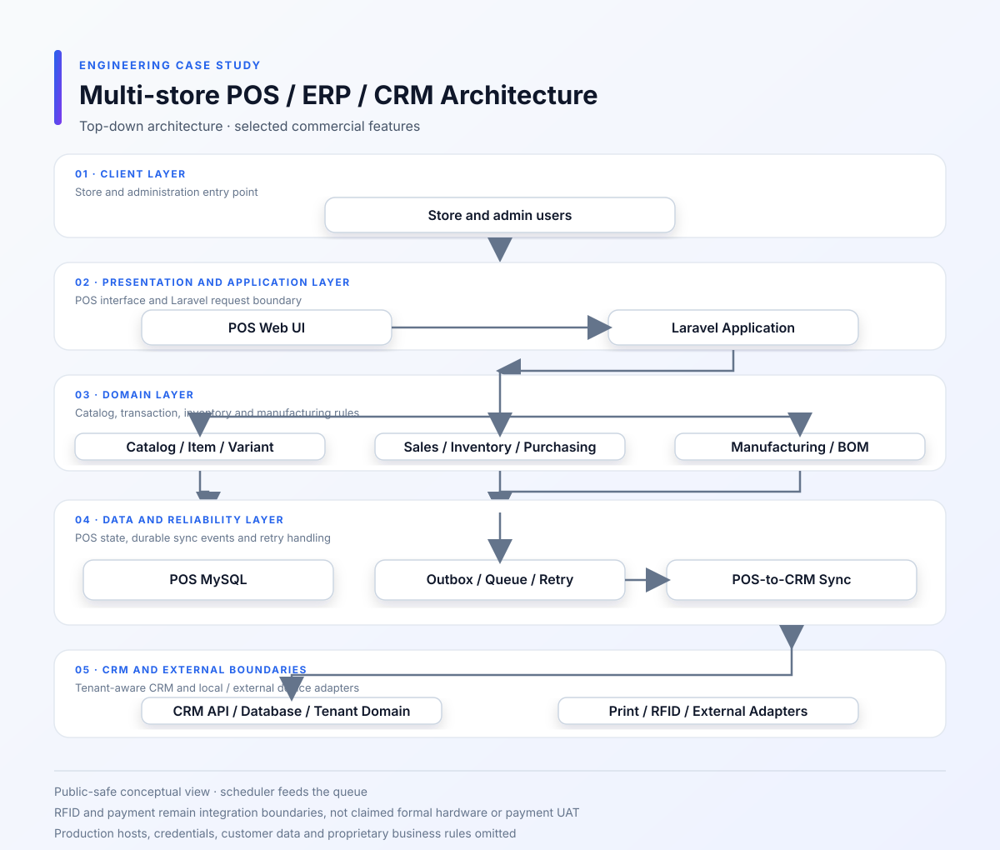
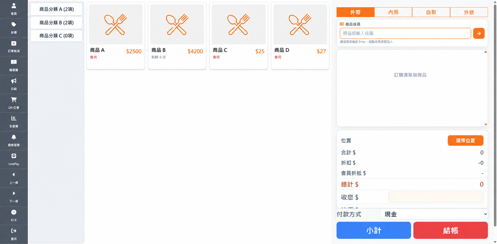
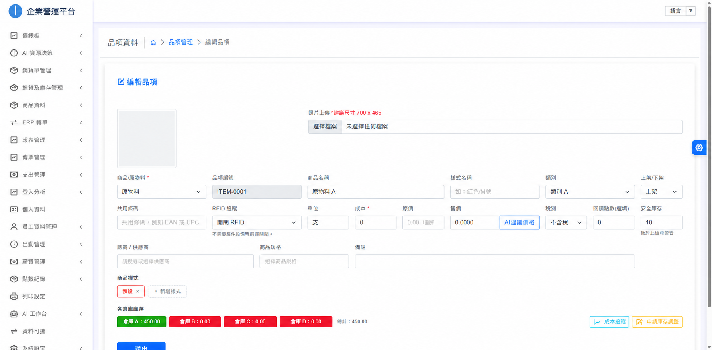
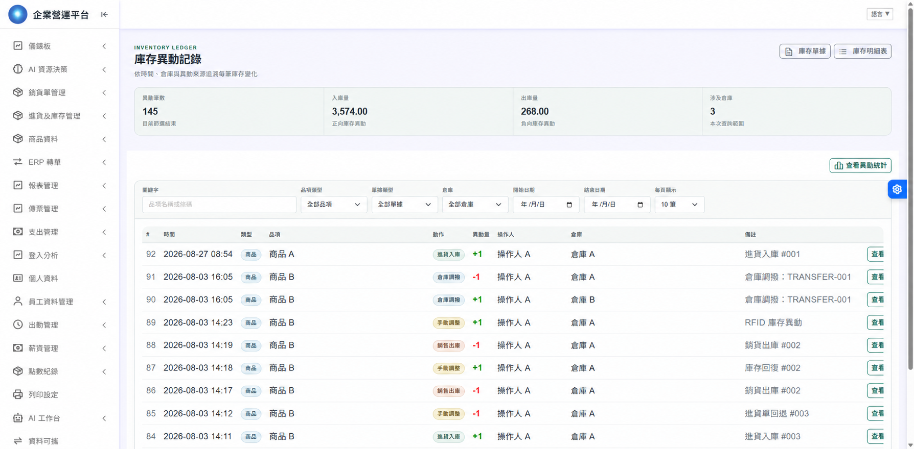
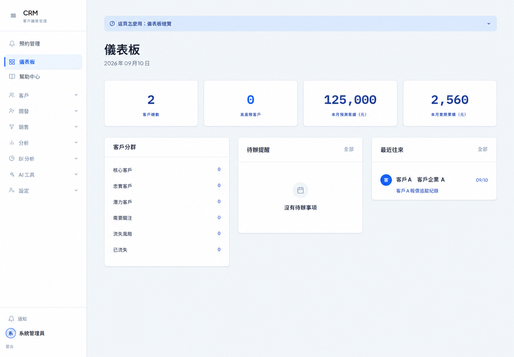

# 多門市 POS／ERP／CRM 整合平台

[English](README.en.md)

**期間：** 2026/03 – 2026/09 
**專案類型：** 商業專案／全職工作 
**角色：** Full-stack Engineer 
**重點：** 商品與庫存建模 · BOM／製造 · 多門市 · POS／CRM 整合

## 我接手時的狀況

這套 POS 原本已經有不少既有功能，我接手後主要是在原架構上繼續擴充。需求一路增加到多門市、倉庫調撥、Variant、BOM、製造和 CRM 同步，原本商品、原料和庫存的模型開始互相卡住，所以其中一大段工作是在整理舊流程，而不是單純新增頁面。

## 我實際做的部分

- 整理商品、原料、分類與 Variant 的資料關係
- 讓多層 BOM 可以展開，並接到製造與庫存流程
- 處理採購、進貨、銷售、退貨、出貨、調撥與多倉庫庫存異動
- 補上成本歷史、庫存變更、條碼收貨與主檔匯入
- 維護員工、報表、會計與多門市管理介面
- 串接 POS 與 CRM 的商品、分類、原料及交易資料
- 處理部署腳本、Queue、排程、問題排查與測試驗證

## 幾個比較麻煩的問題

### 商品、原料與庫存不是同一種東西

既有流程對 item、商品、原料和 Variant 的假設不完全一樣。新增功能時如果只在畫面上補欄位，很容易讓採購、製造和銷售各自用不同規則。我先把這些資料如何進入庫存、成本和同步流程整理出來，再調整各流程的寫入邊界。

### BOM 展開之後，庫存才真正有意義

BOM 不只是顯示父子樹狀關係，展開結果會影響工單材料、需求數量、投料與後續入庫。遇到多層元件或重複品項時，平面查詢順序不夠用，因此改用樹狀走訪與排序，也要避免循環關係讓流程一直展開。

### POS 交易不能被 CRM 綁住

如果 POS 每次異動都同步等待 CRM，CRM 暫時失敗就會直接影響門市作業。我把主交易和背景同步拆開，用 Outbox 記下要同步的事件，再交給 Queue 處理 Retry／Backoff、Idempotency、Dead Letter、HMAC 與 Circuit Breaker。這樣重送時不會把同一筆商品或交易重複建立。

## 架構與重要流程

- [POS 與 CRM 同步流程](diagrams/pos-crm-sync.svg)
- [Item / BOM 領域模型](diagrams/item-bom-domain.svg)
- [製造流程](diagrams/manufacturing-flow.svg)
- [Mermaid 原始圖](diagrams/system-architecture.mmd)

## 畫面展示

以下畫面只展示功能邊界，已移除品牌、租戶、內部編號與其他識別資訊。

## 技術與外部整合

Backend 使用 Laravel／PHP，前端是 HTML、JavaScript 與 Bootstrap-based UI，資料庫為 MySQL；部署環境包含 Apache、Scheduler、Database Queue、Queue Worker 與 Print Adapter。

**skills:** PHP, Laravel, JavaScript, MySQL, REST API, Multi-tenant, RBAC, Outbox Pattern, Queue, Idempotency, HMAC

實際接觸的外部流程包含 Google Calendar 雙向預約、電商訂單匯入、條碼收貨、LINE OA 出勤、電子發票，以及 USB／Wi-Fi 收據列印。

## 取捨與公開範圍

目前文件只放可以公開討論的功能與設計。正式網址、原始碼、憑證、客戶資料與部署證據不公開；RFID 實體讀卡器和付款流程也只記錄為整合邊界，不宣稱已完成正式硬體或付款 UAT。
