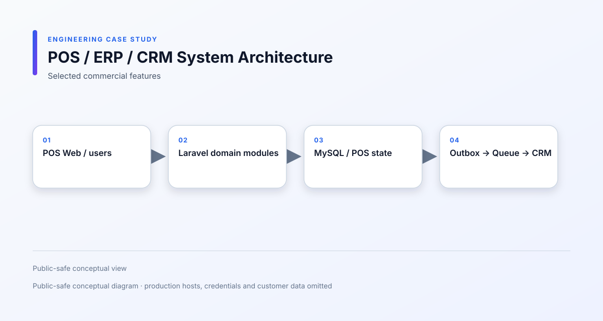
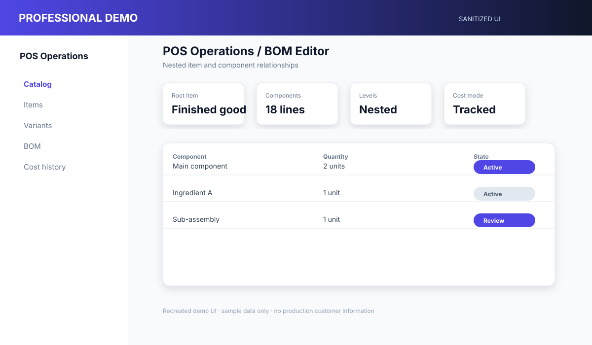

# POS / ERP / CRM Platform

[繁體中文](README.md)

**Period:** 2026/03 – 2026/09 
**Type:** Commercial / Full-time 
**Role:** Full-stack Engineer 
**Focus:** Legacy Modernization · ERP · Domain Modeling · System Integration

## 1. Overview

A multi-store POS and business operations platform covering catalog, purchasing, inventory, manufacturing, sales, finance and CRM integration.

This case study focuses on selected engineering work completed from **May 2026 to the present**, not the complete commercial system.

## 2. Project Context

The original system grew from core POS and financial workflows. As the business expanded into multi-store operations, warehouse transfers, manufacturing, item variants, BOM and CRM synchronization, the existing domain model and operational flows needed to be reorganized.

## 3. My Role

**Full-stack Engineer**

I worked across:

- Backend and frontend development
- Domain and database modeling
- Legacy workflow refactoring
- Inventory and manufacturing logic
- POS-to-CRM integration
- Deployment scripts and troubleshooting
- UI consistency and test verification

## 4. Scope & Responsibilities

Selected responsibilities included:

- Consolidating item, ingredient, category and variant behavior
- Implementing parent-child item and variant workflows
- Designing multi-level BOM traversal and manufacturing flows
- Handling purchasing, receiving, sales, shipping and warehouse transfers
- Recording item cost history and inventory changes
- Building barcode receiving and master-data import workflows
- Adding POS-to-CRM catalog and transaction synchronization
- Maintaining outbox, queue, retry and duplicate-event protection
- Improving employee, report, accounting and operations interfaces
- Maintaining multi-store deployment and environment synchronization scripts

## 5. Tech Stack

**Backend**  
Laravel, PHP

**Frontend**  
HTML, JavaScript, Bootstrap-based operational interfaces

**Database**  
MySQL

**Integration**  
REST APIs, database queue, Outbox pattern, POS-to-CRM synchronization

**Runtime**  
Apache, scheduled tasks, queue workers, print and external-device adapters

## 6. System Architecture

[View Mermaid source](diagrams/system-architecture.mmd)

## 7. Key Engineering Challenges

### Unifying item and inventory concepts

Products, ingredients, variants and legacy item records had different assumptions. I reorganized the data flow so purchasing, inventory, sales, manufacturing and external synchronization could use consistent domain rules.

### Preserving inventory consistency

Manufacturing, receiving, shipping, transfer and adjustment operations can affect the same stock records. I traced status transitions and corrected cases involving duplicate deduction, missing deduction, cost history and transfer completion.

### Representing multi-level BOM relationships

A BOM may contain nested components and repeated items. I implemented tree-based traversal and ordering so parent-child relationships remain understandable to operators and usable by downstream inventory processes.

### Synchronizing with CRM

POS changes must be delivered to another system without blocking the main operation. I separated business writes from synchronization work and added observable retry and idempotency boundaries.

## 8. Technical Decisions

- Use an Outbox boundary so a local POS transaction is not dependent on immediate CRM availability.
- Treat POS as the source for POS-owned operational fields and prevent accidental overwrites from another system.
- Keep inventory-changing operations explicit by workflow and status.
- Use tree traversal for BOM presentation and processing instead of relying on flat query order.
- Derive frontend API origin from the current deployment context instead of hardcoding one host.

## 9. Important Flows

- Catalog and item synchronization: [POS-to-CRM sync](diagrams/pos-crm-sync.svg)
- Item and BOM relationships: [Item/BOM domain](diagrams/item-bom-domain.svg)
- Manufacturing and inventory movement: [Manufacturing flow](diagrams/manufacturing-flow.svg)

## 10. Reliability & Security

- Tenant and store scope checks
- Queue-based integration
- Retry and duplicate-event protection
- Explicit inventory reservation and deduction boundaries
- CSRF and security-header handling
- Safe import validation
- Deployment cache and route refresh procedures

RFID UI and data flow are documented as an integration boundary. Physical reader input is not presented as completed production validation. Payment adapters are also excluded from any claim of formal payment UAT.

## 11. External Integrations

- CRM APIs
- Printing and print-agent boundary
- RFID integration boundary
- External attendance
- Import and synchronization tools

## 12. Screenshots

The following are recreated, sanitized demo interfaces for portfolio presentation:

- [POS Operations Dashboard](screenshots/pos-dashboard.svg)
- [BOM Editor](screenshots/bom-editor.svg)
- [Manufacturing Order](screenshots/manufacturing-order.svg)

They use sample data and are not production screenshots.

## 13. Trade-offs & Limitations

The case study describes selected commercial functionality. Production hostnames, source code, credentials, customer data and formal deployment evidence are intentionally excluded.

Some external integrations require hardware, payment-provider or production-environment validation and are therefore marked as pending rather than presented as completed outcomes.

## 14. Outcome

The selected work extended the platform from basic POS operations into a broader set of store, warehouse, manufacturing and CRM workflows while making the integration boundary more explicit and maintainable.

## 15. What I Learned

This work strengthened my understanding of legacy domain refactoring, inventory consistency, manufacturing data modeling and the practical trade-offs involved in synchronizing business systems.

## 16. Confidentiality

This is a commercial project.

Production source code, credentials, customer data and proprietary business information are not included. Architecture and implementation details have been simplified or anonymized for portfolio presentation.
