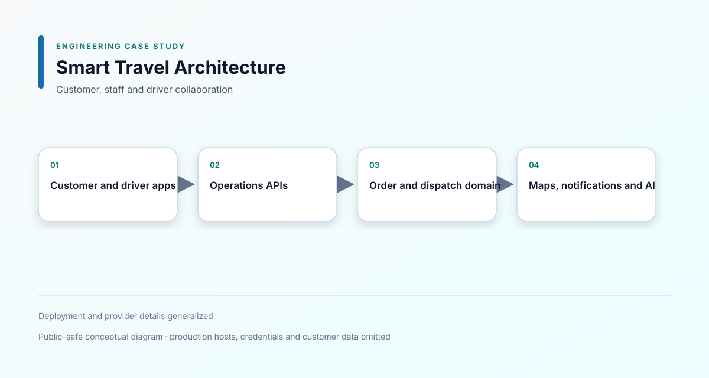

# Smart Travel Platform

**Period:** 2026/05 – Present 
**Type:** Commercial / Full-time 
**Role:** Full-stack Engineer 
**Focus:** Next.js · Expo · Dispatch · GPS · Authentication

> 連接客戶、營運人員與司機的旅運協作平台；本頁聚焦訂單生命週期、派車、GPS 與角色邊界。

## 1. Overview

A travel operations and dispatch platform connecting customers, operations staff, drivers and trip tracking.

## 2. Project Context

Travel operations require several roles to coordinate around the same order. Booking, dispatch, driver status, GPS information, notifications and exceptions must remain understandable even when updates arrive at different times.

## 3. My Role

**Full-stack / Platform Engineer**

I worked across:

- Next.js web application
- Expo customer and driver experiences
- API integration
- Order and dispatch workflows
- GPS and map interaction
- Authentication and authorization
- Notification and deployment flows
- Security and correctness fixes

## 4. Scope & Responsibilities

Selected responsibilities included:

- Connecting unfinished screens to real APIs
- Building customer booking and account flows
- Building driver login, profile, settings and income views
- Implementing dispatch assignment, accept and reject behavior
- Synchronizing order, dispatch and driver status
- Adding map markers, navigation and trip sharing
- Implementing customer tracking and service-time access rules
- Handling notifications and deep links into order details
- Supporting AI-assisted order drafting
- Fixing mobile web routing and Expo subpath deployment
- Addressing authentication, rate-limit and proxy-header issues

## 5. Tech Stack

**Web**  
Next.js, React

**Mobile**  
Expo, React Native

**Backend and Data**  
API services, Prisma, PostgreSQL and JSON-backed operational data

**Integration**  
Maps, GPS, SMS, push notifications, Slack and LLM services

**Deployment**  
Docker and CI deployment workflows

## 6. System Architecture

[View Mermaid source](diagrams/system-architecture.mmd)

## 7. Key Engineering Challenges

### Keeping order and dispatch state consistent

An order may be pending, assigned, accepted, rejected, in progress or completed. I corrected mismatches between customer, dispatch and driver views so each role receives the appropriate state.

### Coordinating GPS and tracking access

Tracking should expose useful information without making the trip publicly visible at all times. I added service-time boundaries, destination markers and controlled share links.

### Supporting multiple clients

The same backend must serve operations staff, customers, drivers, web and native app flows. I separated environment and API-origin behavior so web and native clients can use the correct connection strategy.

### Completing incomplete application surfaces

Several screens existed before their API and state behavior were complete. I connected them to real endpoints and handled loading, error, logout, refresh and empty states.

## 8. Technical Decisions

- Treat order status as the shared business state and derive role-specific views from it.
- Keep dispatch focus navigation separate from automatic modal behavior.
- Use polling where it is simple and sufficient, while keeping a path toward event-based updates.
- Use short-lived or time-bound tracking access rather than unrestricted public tracking.
- Keep web and native API configuration separate at runtime.

## 9. Important Flows

- Booking to trip completion: [Order lifecycle](diagrams/order-lifecycle.svg)
- Driver and vehicle location: [GPS tracking](diagrams/gps-tracking.svg)
- Role and route boundaries: [Authorization scope](diagrams/authorization-scope.svg)

## 10. Reliability & Security

- JWT and password handling
- Role-specific route and data scope
- Rate-limit protection against spoofed proxy headers
- Tracking time-window control
- Soft-delete filtering
- Driver assignment and rejection recovery
- Status polling and stale-state handling
- Mobile logout and session cleanup

## 11. External Integrations

- Map and geocoding services
- GPS and native maps
- SMS and push notifications
- Slack notifications
- LLM-assisted order drafting
- Prisma and PostgreSQL

## 12. Screenshots

The following are recreated, sanitized demo interfaces for portfolio presentation:

- [Dispatch Dashboard](screenshots/dispatch-dashboard.svg)
- [Driver Tracking](screenshots/driver-tracking.svg)

They use sample data and are not production screenshots.

## 13. Trade-offs & Limitations

Polling keeps the first implementation easier to understand and operate, but high concurrent usage may justify SSE or WebSocket events for selected status changes.

The case study does not claim production mobile-store release or third-party provider SLA.

## 14. Outcome

The selected features connect booking, operations, dispatch, driver execution and customer tracking into one role-aware operational workflow.

## 15. What I Learned

This project reinforced that multi-role products are primarily state and permission problems. A good interface must make the same order understandable from each participant's point of view.

## 16. Confidentiality

This is a commercial project.

Production source code, credentials, customer data and proprietary business information are not included. Architecture and implementation details have been simplified or anonymized for portfolio presentation.
