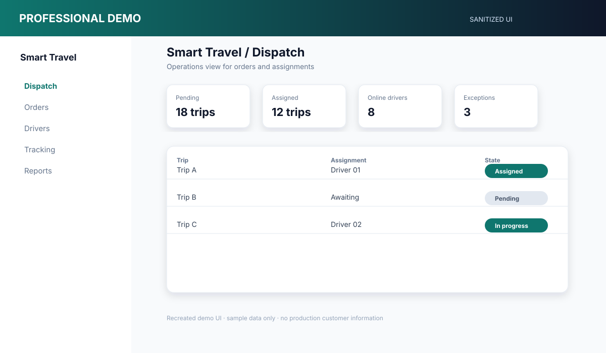

# Smart Travel 旅運平台

[English](README.en.md)

**期間：** 2026/06 – 2026/07 
**專案類型：** 商業專案／全職工作 
**角色：** Full-stack Engineer 
**重點：** Next.js · Expo · Dispatch · GPS · Authentication

## 一、專案概述

連接客戶、營運人員、司機與行程追蹤的旅運協作與派車平台。

## 二、專案背景

旅運作業需要多種角色共同處理同一筆訂單。預約、派車、司機狀態、GPS、通知與異常流程必須在不同畫面間保持一致。

## 三、我的角色

我負責 Next.js Web、Expo 客戶端與司機端、API 串接、訂單與派車流程、GPS 與地圖、身份驗證、通知、部署與安全性修正。

## 四、負責範圍

- 將未完成畫面接上實際 API
- 建立客戶預約、帳號與訂單流程
- 建立司機登入、個人設定與收入頁面
- 實作派車、接單、拒單與司機上線狀態
- 同步訂單、派車與司機狀態
- 加入地圖標記、導航、行程分享與即時追蹤
- 補上客戶評價、異常回報與營運通知流程
- 實作服務時間與 Tracking Access 控制
- 處理通知與 Deep Link
- 整合 AI 訂單解析、派車建議、異常分類與營運風險提示
- 修正 Expo Web 路由與子路徑部署
- 處理 JWT、Rate Limit、Proxy Header 與 GPS 問題

## 五、技術環境

- Web：Next.js、React
- Mobile：Expo、React Native
- Backend / Data：API Services、Prisma、PostgreSQL、JSON-backed data
- Integration：Maps、GPS、SMS、Push、Slack、LLM
- Deployment：Docker、CI

**skills:** TypeScript, Next.js, React Native, Expo, Prisma, PostgreSQL, JWT, REST API, GPS, Push Notification, LLM

## 六、系統架構

- [Mermaid 原始圖](diagrams/system-architecture.mmd)
- [訂單生命週期](diagrams/order-lifecycle.svg)
- [GPS 追蹤流程](diagrams/gps-tracking.svg)
- [授權範圍](diagrams/authorization-scope.svg)

## 七、主要工程挑戰

### 維持訂單與派車狀態一致

訂單可能經過待處理、已派遣、已接單、拒單、執行中與完成等狀態。我修正客戶、營運與司機畫面之間的狀態不同步問題。

### 協調 GPS 與追蹤權限

追蹤功能需要在有用與安全之間取得平衡，因此加入服務時間、分享連結與權限範圍控制。

### 支援多種使用端

同一個後端需要服務營運人員、客戶、司機、Web 與 Native App，因此分離 Web 與 Native 的 API 來源與執行環境。

### 補完原有雛形頁面

部分頁面只有 UI 雛形，我負責接上 API，並補充 Loading、Error、Logout、Refresh 與 Empty State 行為。

## 八、技術決策

- 以訂單狀態作為共同業務狀態，再產生各角色的畫面。
- 將派車焦點導覽與自動開啟 Modal 分離。
- 先使用易維護的 Polling，保留未來改用事件推送的空間。
- 使用時間限制與範圍控制保護行程追蹤。
- 將 Web 與 Native API 設定分開處理。

## 九、可靠性與安全性

- JWT 與密碼處理
- 角色路由與資料範圍
- Proxy Header Rate-limit 防護
- Tracking Time Window
- Soft-delete 過濾
- 司機拒單後的派車恢復
- Status Polling 與 Stale State 處理
- Mobile Logout 與 Session Cleanup

## 十、重製畫面

- [Dispatch Dashboard](screenshots/dispatch-dashboard.svg)
- [Driver Tracking](screenshots/driver-tracking.svg)

以上均為去識別化重製畫面，使用範例資料，不是正式客戶截圖。

## 十一、取捨與限制

Polling 讓初期流程較容易理解與維運；若同時使用者增加，可將高價值狀態更新改為 SSE 或 WebSocket。

本案例不宣稱正式 Mobile Store 上架或第三方服務 SLA。

## 十二、成果

將預約、營運、派車、司機執行與客戶追蹤串成同一套具備角色邊界的作業流程。

## 十三、學習

這個專案讓我更清楚理解，多角色產品的核心通常是狀態與權限，而不是單純畫面數量。

## 保密聲明

這是商業專案。公開內容不包含正式原始碼、憑證、客戶資料或專有商業資訊。
