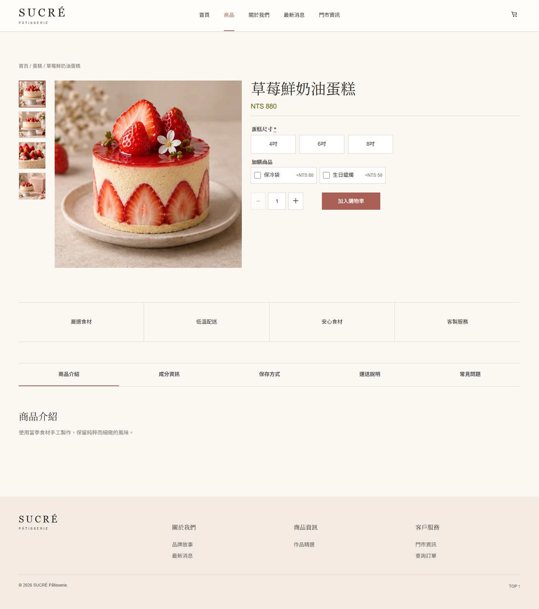
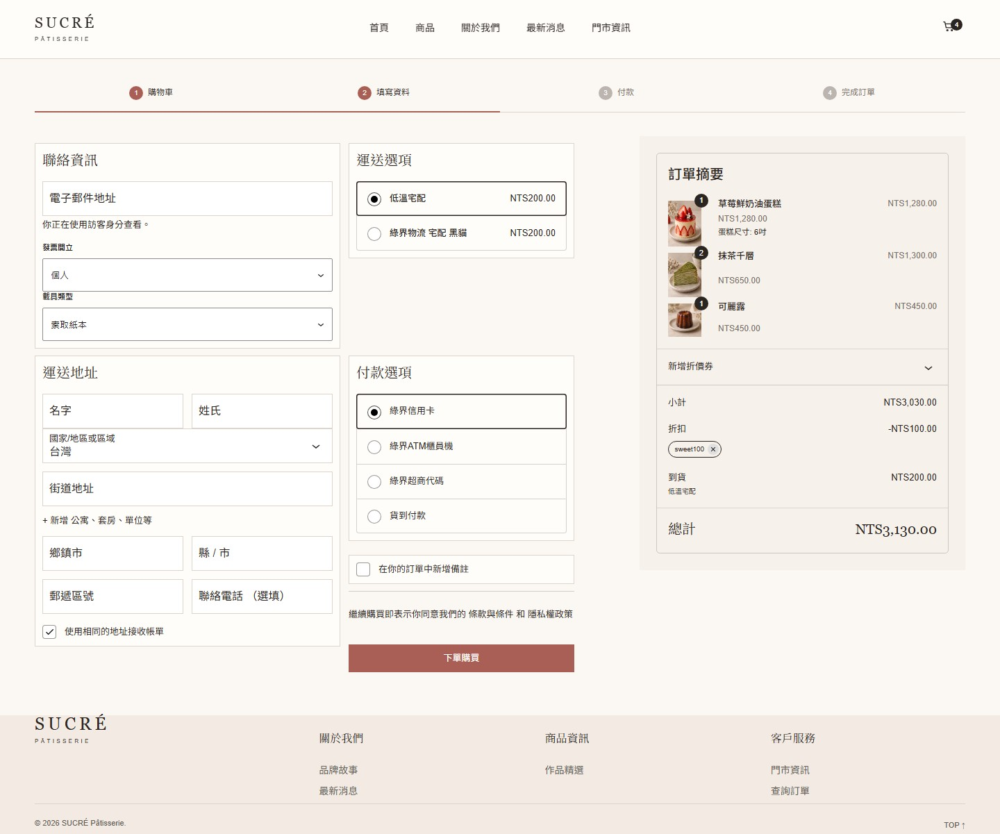

# SUCRÉ Patisserie WooCommerce Store

[繁體中文](README.md)

**Project type:** Self-initiated portfolio demo / concept brand 
**Role:** WordPress / WooCommerce Developer 
**Status:** Local Docker showcase; not deployed as a production store 
**Focus:** High-fidelity design implementation · Custom Theme / Plugin · Product customization · WooCommerce journey · Responsive UI

## Goal

Translate a patisserie design into a store powered by WordPress and WooCommerce—not a prebuilt theme or a static-only mockup. The case demonstrates visual implementation together with product administration, custom options, checkout presentation, and a reproducible local environment.

## What I built

- A custom WordPress theme for layout, product and content templates, responsive behavior, navigation, and UI interactions.
- A custom WooCommerce plugin for cake-size pricing, add-on relationships, delivery-date rules, and order-item data.
- WooCommerce products, carts, coupons, Checkout Blocks, and orders are used without modifying WordPress or WooCommerce Core.
- The catalog supports keyword search, category, price range, multi-select flavor filters, and sorting; add-ons are managed as separate WooCommerce products.
- A one-time email verification flow protects guest order lookup before showing an order summary.
- Docker Compose runs WordPress, WooCommerce, and MariaDB together, with the database kept on the internal Docker network.

## Architecture and ownership

| Layer | Responsibility |
| --- | --- |
| Custom Theme | UI, layouts, templates, responsive behavior, and presentation |
| Custom Plugin | Product-customization rules, add-on associations, delivery-date validation, and order metadata |
| WooCommerce | Products, cart, coupons, checkout, orders, and customers |
| Docker Compose | Reproducible local services and database isolation |

Cake sizes (4, 6, and 8 inches) are currently custom product options with pricing rules, **not WooCommerce variations or SKUs**. Candles and cooler bags are separate products with their own SKU, price, and stock. Payment, invoice, and logistics integrations remain at WooCommerce extension boundaries rather than modifying Core.

## Screens

### Product detail

### Checkout

### Responsive screenshot matrix

| Page | Desktop 1440px | Tablet 768px | Mobile 390px |
| --- | --- | --- | --- |
| Home | [View](screenshots/visual-runtime-home-desktop.jpg) | [View](screenshots/visual-runtime-home-tablet.jpg) | [View](screenshots/visual-runtime-home-mobile.jpg) |
| Product listing | [View](screenshots/visual-runtime-products-desktop.jpg) | [View](screenshots/visual-runtime-products-tablet.jpg) | [View](screenshots/visual-runtime-products-mobile.jpg) |
| Product detail | [View](screenshots/visual-runtime-product-desktop.jpg) | [View](screenshots/visual-runtime-product-tablet.jpg) | [View](screenshots/visual-runtime-product-mobile.jpg) |
| Cart | [View](screenshots/visual-runtime-cart-desktop.jpg) | [View](screenshots/visual-runtime-cart-tablet.jpg) | [View](screenshots/visual-runtime-cart-mobile.jpg) |
| Checkout | [View](screenshots/visual-runtime-checkout-desktop.jpg) | [View](screenshots/visual-runtime-checkout-tablet.jpg) | [View](screenshots/visual-runtime-checkout-mobile.jpg) |
| About | [View](screenshots/visual-runtime-about-desktop.jpg) | [View](screenshots/visual-runtime-about-tablet.jpg) | [View](screenshots/visual-runtime-about-mobile.jpg) |
| News | [View](screenshots/visual-runtime-news-desktop.jpg) | [View](screenshots/visual-runtime-news-tablet.jpg) | [View](screenshots/visual-runtime-news-mobile.jpg) |
| Store information | [View](screenshots/visual-runtime-contact-desktop.jpg) | [View](screenshots/visual-runtime-contact-tablet.jpg) | [View](screenshots/visual-runtime-contact-mobile.jpg) |
| Order lookup | [View](screenshots/visual-runtime-order-lookup-desktop.jpg) | [View](screenshots/visual-runtime-order-lookup-tablet.jpg) | [View](screenshots/visual-runtime-order-lookup-mobile.jpg) |

## QA and public scope

Full-page screenshots are available for nine WordPress/WooCommerce routes at Desktop, Tablet, and Mobile widths (27 images total). The capture workflow checks viewport dimensions, horizontal overflow, a basic accessibility smoke test, and the absence of the WordPress admin toolbar. Checkout captures also require the expected products to be rendered and loading skeletons to be gone. Cart and checkout screenshots use synthetic local test data.

This is a portfolio demo, not an operating store or proof of production payment acceptance. Live ECPay / LINE Pay transactions, e-invoices, carrier fulfillment, and SMTP delivery still require merchant accounts, credentials, and their own end-to-end tests. The public repository contains this case study and screenshots only—not the full site source, credentials, live orders, or customer information.

**skills:** WordPress, WooCommerce, PHP, Docker Compose, Store API, HPOS, Checkout Blocks, Responsive Design, Accessibility, Visual Regression
