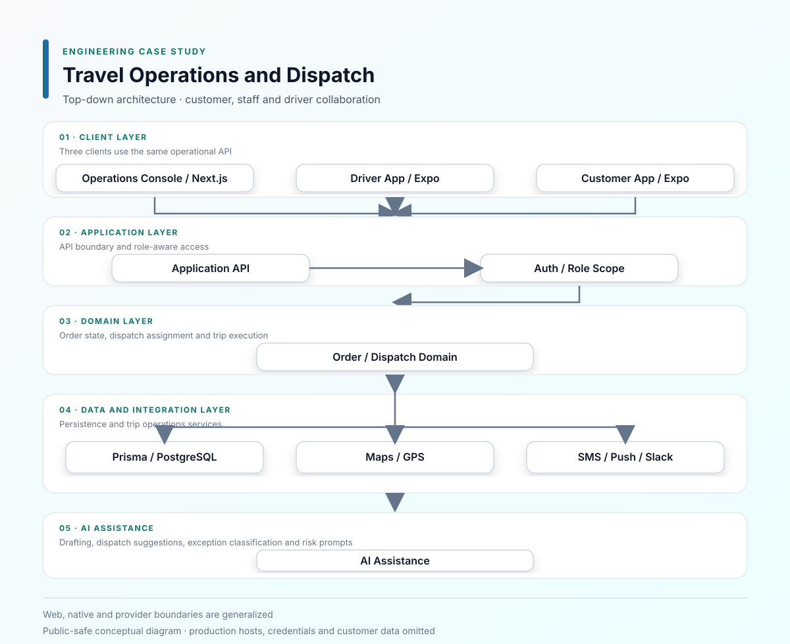
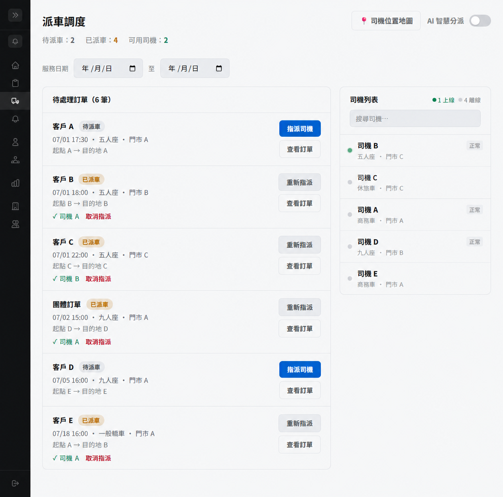
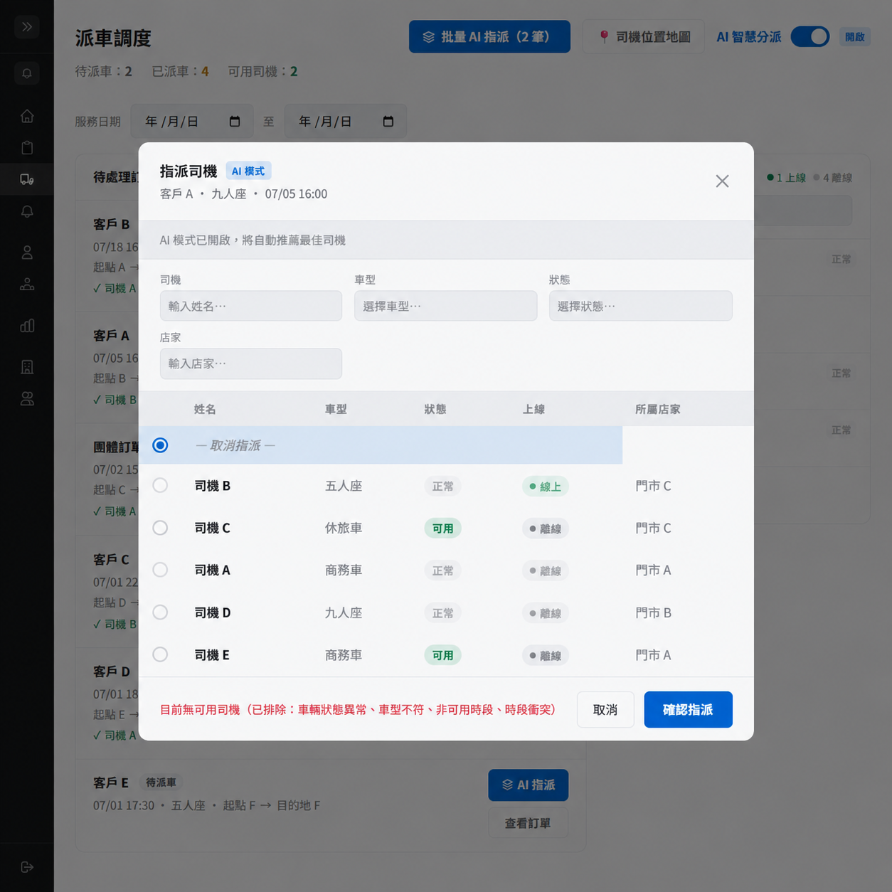
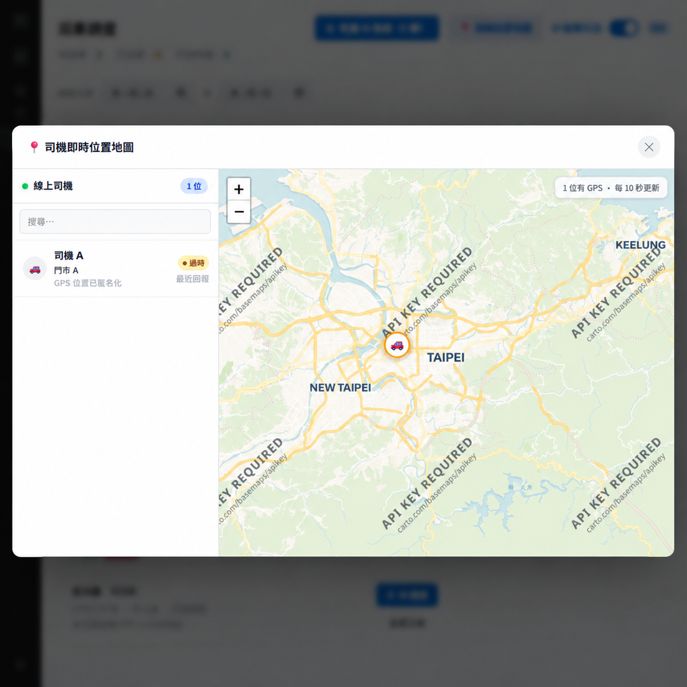

# 智慧旅運訂單與派車平台

[English](README.en.md)

**期間：** 2026/06 – 2026/07 
**專案類型：** 商業專案／全職工作 
**角色：** Full-stack Engineer 
**重點：** Next.js · Expo · Dispatch · GPS · Authentication

## 這個系統要處理什麼

一筆旅運訂單會在客戶、營運人員和司機之間流轉。客戶要能預約和查看行程，營運人員要能派車、處理異常，司機則要能接單、回報位置並完成行程。這些流程如果各自維護一份狀態，很快就會出現「後台顯示已派車，但司機端還看不到」之類的問題。

## 我實際做的部分

我接手時有些頁面已經有 UI，但還沒有完整接上 API 或處理例外狀態。主要工作包括：

- 補上客戶預約、帳號與訂單流程。
- 建立司機登入、個人設定、收入、上線、接單與拒單流程。
- 串接營運後台的派車、批次派車、司機篩選與訂單狀態操作。
- 處理訂單、派車和司機執行狀態在不同端的同步。
- 加入地圖標記、導航、行程分享、GPS 位置回報與公開追蹤。
- 補上客戶評價、異常回報、通知與 Deep Link。
- 整合 AI 訂單解析、派車建議、異常分類與營運風險提示。
- 修正 Expo Web 路由、子路徑部署、JWT、Rate Limit 與 Proxy Header 問題。

## 比較容易卡住的地方

### 同一筆訂單有太多角色在改

訂單可能經過待派車、已派車、已接單、拒單、執行中和完成等狀態。後來我把訂單狀態當成共同的業務狀態，再由客戶、營運和司機端各自決定要顯示哪些操作，避免每個畫面自行推測狀態。

派車也不只是選一個司機。後台會依日期、門市、司機、車型和狀態篩選，還要檢查同一司機前後約三小時的行程衝突；AI 建議可以協助判斷，但最後仍由營運人員確認。

### GPS 追蹤不能一直開著

GPS 需要能反映司機最近的位置，但行程尚未開始或已結束時，不應無限制地公開追蹤。因此我把服務時間、追蹤連結和角色權限分開處理，地圖端只讀取符合條件的司機位置。司機位置在畫面上以定時更新為主，先採用容易維護的 Polling。

### Web 和 App 不是同一個執行環境

營運後台、客戶端和司機端共用後端，但 Web 與 Native 的 API 來源、路由和登入清除行為不同。我分開處理這些設定，也補上 Loading、Error、Refresh、Empty State、Logout 和斷線後重新取得資料的行為。

## 架構與流程

- [Mermaid 原始圖](diagrams/system-architecture.mmd)
- [訂單生命週期](diagrams/order-lifecycle.svg)
- [GPS 追蹤流程](diagrams/gps-tracking.svg)
- [授權範圍](diagrams/authorization-scope.svg)

## 畫面展示

以下畫面展示營運派車、AI 派車建議與司機位置追蹤；客戶、門市、司機與行程識別資訊已去識別化。

## 技術與整合

**Web／Mobile：** Next.js、React、Expo、React Native 
**Backend／Data：** API Services、Prisma、PostgreSQL、JSON-backed data 
**整合：** Maps、GPS、SMS、Push Notification、Slack、LLM 
**部署：** Docker、CI

**skills:** TypeScript, Next.js, React Native, Expo, Prisma, PostgreSQL, JWT, REST API, GPS, Push Notification, LLM

## 取捨與公開範圍

第一版先用 Polling，因為派車和位置更新的需求還不需要引入完整的即時事件基礎設施；如果之後同時在線人數增加，再把高價值狀態改成 SSE 或 WebSocket 會比較合理。

這裡只展示訂單、派車、追蹤和權限等部分功能，不宣稱正式 Mobile Store 上架或第三方服務 SLA。正式原始碼、憑證、客戶資料和商業規則均未公開。

## 保密聲明

這是商業專案。公開內容不包含正式原始碼、憑證、客戶資料或專有商業資訊。
