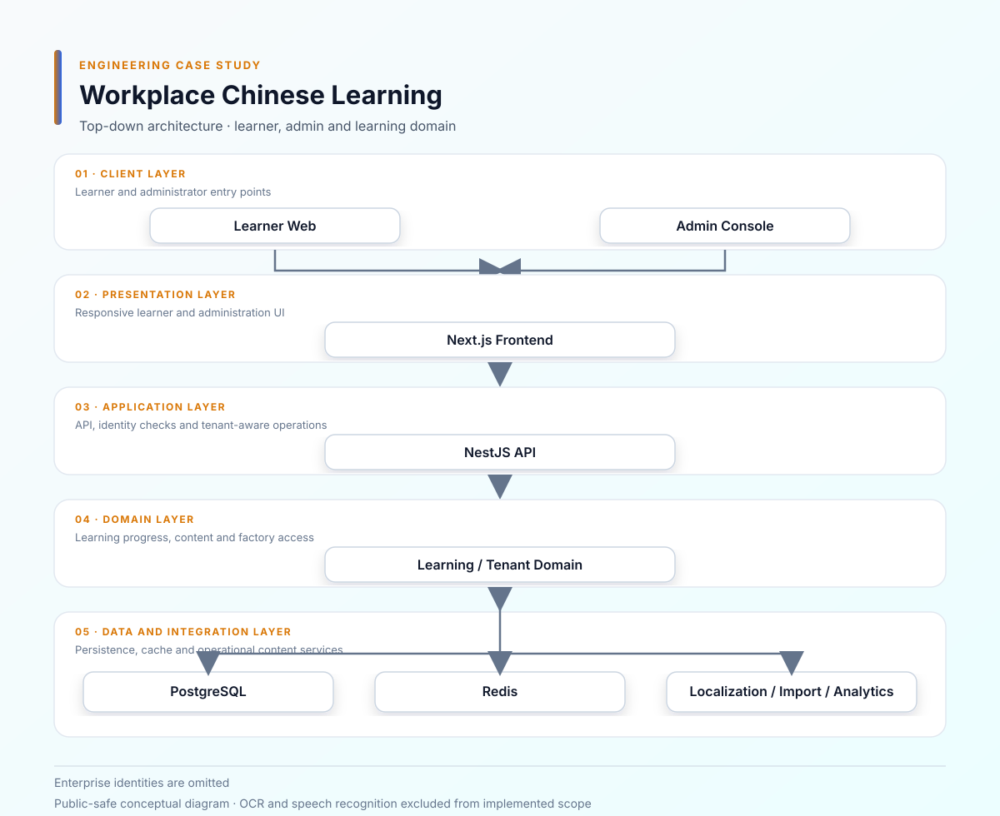
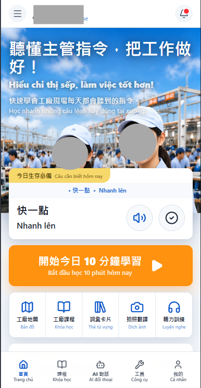
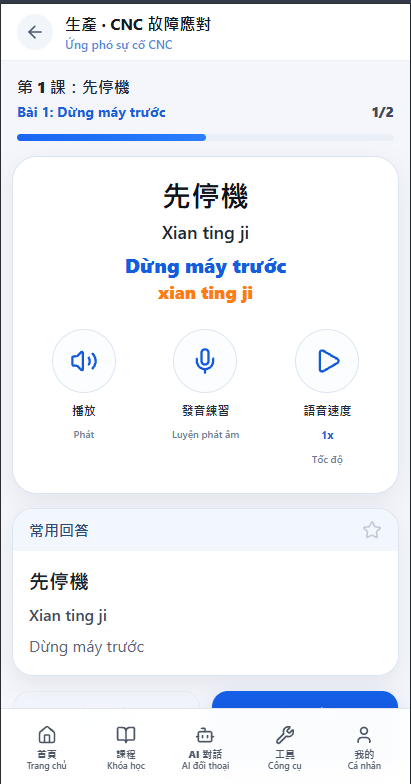

# 工廠中文學習與企業管理平台

[English](README.en.md)

**期間：** 2026/06 – 2026/07 
**專案類型：** 商業專案／全職工作 
**角色：** Full-stack Engineer 
**重點：** Next.js · NestJS · Learning Platform · Multi-tenancy · Analytics

## 這個平台實際在處理什麼

這是一套給工廠與企業使用的中文學習平台。學員端需要能進入課程、查看課節和自己的進度；管理者則要管理員工、教材與學習狀況。除了學習流程，平台還要處理不同工廠的資料隔離，以及越南學員看得懂的內容欄位。

## 我做的部分

我參與學員端、管理後台和後端 API 的整合，主要工作包括：

- 補完課程、課節、教材、進度與學員管理頁面。
- 串接經驗值、Streak、推薦、徽章和證書等學習狀態。
- 整理 HSK 詞彙、拼音、注音、越南語近似發音和工廠情境教材。
- 將管理報表接上 Analytics API，呈現學員參與度與學習狀況。
- 建立 Excel／CSV 批次匯入與後台處理流程。
- 加入多語系內容、驗證、Modal 確認、RWD 和行動版導覽。
- 修正認證、API Route、工廠資料隔離和部署設定。
- 處理 Docker Container Build、Health Route 與實際環境問題。

## 比較容易卡住的地方

### 進度不是畫面上的百分比

課程完成、單課節進度、經驗值和 Streak 都依賴學員實際完成的學習行為。如果只在前端更新百分比，重新整理或從另一個頁面回來就可能對不起來，所以我把這些狀態當成同一套學習流程的一部分，讓前端和 Analytics 使用一致的資料。

### 同一套系統不能看到別的工廠

學員、教材和報表都要跟工廠範圍綁在一起。這部分不是在頁面上加一個 factory 下拉選單就好，而是要把 Tenant Context 帶過認證、API 和後台操作，並檢查管理者實際能存取的範圍。

### 匯入成功不代表資料可以用

後台提供 Excel／CSV 員工批次匯入。真正需要處理的是檔案格式、欄位缺漏、重複資料和單筆失敗；因此匯入流程會顯示處理進度、成功與失敗筆數，以及對應的列號、姓名和錯誤原因，方便管理者修正後重試。

### 教材內容不是只有一個中文欄位

同一個詞彙會有繁體中文、越南語、拼音、注音、近似發音、詞性、分類、HSK 等級、產業和難度等資訊。這些欄位會影響學員端呈現，也會影響後台管理和批次匯入，因此需要在內容模型和表單驗證時一起處理。

## 架構與流程

- [Mermaid 原始圖](diagrams/system-architecture.mmd)
- [學習流程](diagrams/learning-flow.svg)
- [內容匯入](diagrams/content-import.svg)
- [Tenant / RBAC](diagrams/tenant-rbac.svg)

## 畫面展示

以下畫面展示學員首頁與情境課程；品牌、工廠識別與主要人物影像已去識別化。OCR 與語音辨識不列為本專案已完成能力。

## 技術與整合

**Frontend：** Next.js、React、Tailwind-style UI 
**Backend：** NestJS、Node.js 
**Data／Runtime：** PostgreSQL、Redis 
**Application：** 多語系內容、Excel／CSV 批次匯入、Analytics API、Push Notification 
**Infrastructure：** Docker、CI-oriented Deployment

**skills:** TypeScript, Next.js, NestJS, PostgreSQL, Redis, Docker, Multi-tenant, RBAC, PWA

## 取捨與公開範圍

這個案例公開的是課程、學習進度、企業管理、在地化內容和批次匯入等部分功能。OCR 和語音辨識不是這次實際完成的範圍，因此不列為平台已提供的能力；也不包含正式學員資料、企業身份、憑證或商業教材。

## 保密聲明

這是商業專案。公開內容不包含正式原始碼、憑證、客戶資料或專有商業資訊。
